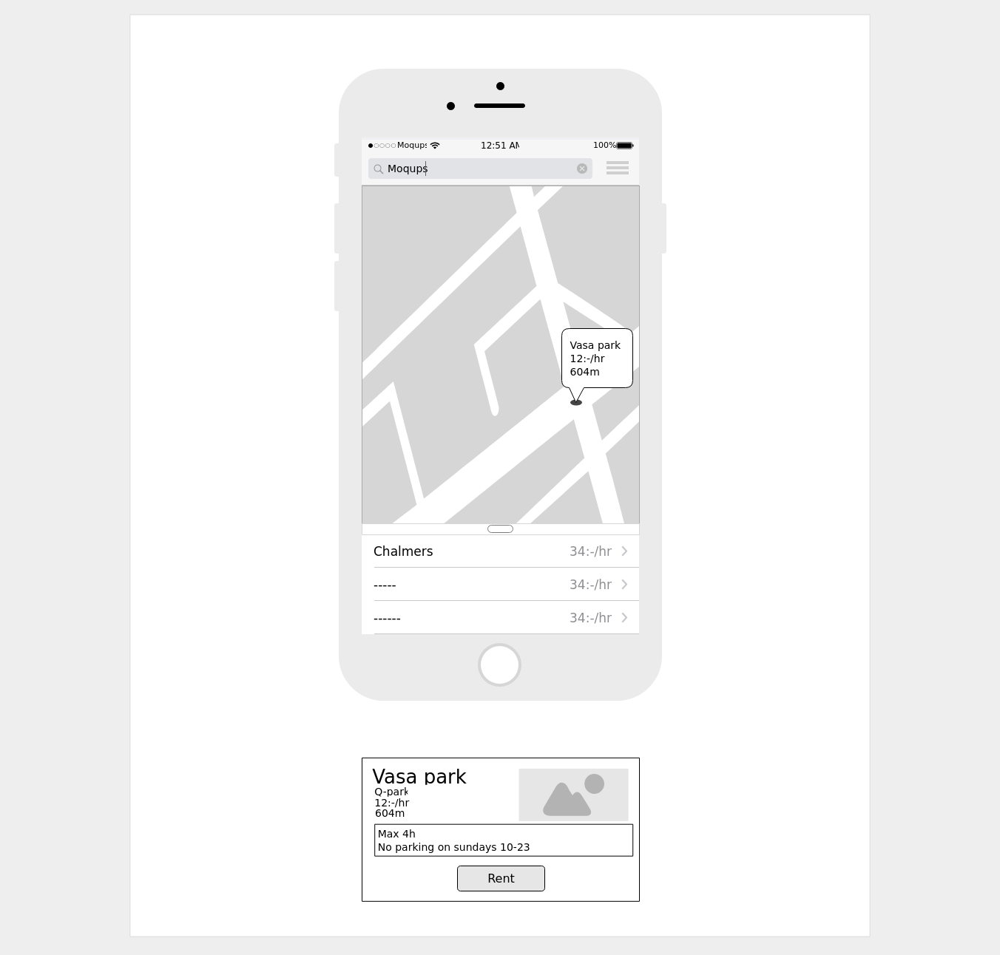
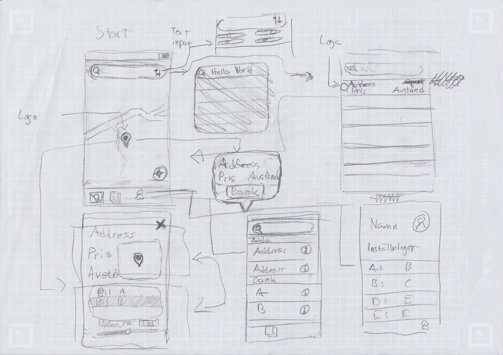

# README

## 1. Hur man kör programmet

För att köra programmet så krävs 2 beroenden, [Node.js](https://nodejs.org/en/download/) (med npm installerat) och [Expo på Google Play Store](https://play.google.com/store/apps/details?id=host.exp.exponent&hl=sv) eller [Expo på App Store](https://itunes.apple.com/us/app/expo-client/id982107779?mt=8). Efter att ha installerat följade beroenden kan man köra programmet efter några enkla kommandon. Öppna projekt mappen efter att ha laddat ner programmet i en terminal eller ett av windows commandline verktyg. Skriv in följande kommandon.

För att installera expo globalt i Node så behöver man köra följande kommando.

```bash
npm i -g expo-cli
```

Ändra den aktiva mappen shell verktyget arbetar i genom att köra följande kommando.

```bash
cd app/parkit
```

För att installera projektets lokala Node beroende behöver följande kommando köras.

```bash
npm i
```

Slutgliltligen kör ett kommando för att starta expo verktygen på datorn.

```bash
npm start
```

En websida kommer öppnas och en QR kod kommer visas efter några sekunder. På iOS telefoner startar man kamera appen och skannar QR-koden så kommer applikationen starta, på Android startar man Expo och skannar QR-koden.

## 2. Tester (hur? vad? stats?)

Testerna använder jest och har ett färdigt skript redo att köra testerna. Vi kollar coverage, vilka filer vi testar och vi har ett mål med att testa 70% av koden. Testerna är skrivna för att beskriva vad det testar och beskrivs `app\parkit\__test__`. För köra testerna efter att ha laddat ner programmet öppna mappen i en terminal eller ett av windows commandline verktyg

Skriv in följande kommando för att ändra den aktiva mappen.

```bash
cd app\parkit
```

Skriv in följande kommando för att köra testerna med coverage.

```bash
npm test --coverage
```

```Jest
 PASS  __test__/backend/AsyncStorage.test.tsx
 PASS  __test__/backend/DataGatherer.test.tsx
 PASS  __test__/common/Store.test.tsx
 PASS  __test__/common/ParkingElement.test.tsx
 PASS  __test__/common/PSpotsList.test.tsx
 PASS  __test__/usage/ParkingHistory.test.tsx
 PASS  __test__/common/RentButton.test.tsx (7.811s)
```

| File                              | % Statements | % Branch | % Funcs | % Lines | Uncovered Line #s  |
| --------------------------------- | ------------ | -------- | ------- | ------- | ------------------ |
| All files                         | 63.11        | 40.91    | 41.67   | 61.8    |                    |
| assets                            | 100          | 100      | 100     | 100     |                    |
| carpark.png                       | 100          | 100      | 100     | 100     |                    |
| assets/parking-providers/logo     | 100          | 100      | 100     | 100     |                    |
| easypark.png                      | 100          | 100      | 100     | 100     |                    |
| gothenburg-list.png               | 100          | 100      | 100     | 100     |                    |
| gothenburg.png                    | 100          | 100      | 100     | 100     |                    |
| qpark.png                         | 100          | 100      | 100     | 100     |                    |
| src                               | 100          | 100      | 100     | 100     |                    |
| styles.ts                         | 100          | 100      | 100     | 100     |                    |
| types.ts                          | 100          | 100      | 100     | 100     |                    |
| src/backend/datagatherer          | 26.83        | 50       | 12.5    | 26.83   |                    |
| DataGatherer.tsx                  | 26.83        | 50       | 12.5    | 26.83   | ... 90,193,194,197 |
| src/backend/storage               | 50           | 100      | 25      | 50      |                    |
| Asyncstorage.tsx                  | 50           | 100      | 25      | 50      | 21,23,26,35,36     |
| src/backend/store                 | 64.84        | 42.86    | 33.33   | 62.2    |                    |
| Store.tsx                         | 64.84        | 42.86    | 33.33   | 62.2    | ... 14,261,267,279 |
| src/common/list                   | 100          | 100      | 100     | 100     |                    |
| List.tsx                          | 100          | 100      | 100     | 100     |                    |
| src/common/logoloader             | 50           | 0        | 0       | 50      |                    |
| LogoLoader.tsx                    | 50           | 0        | 0       | 50      | 61,63,65,67,78,80  |
| src/common/parkingelement         | 100          | 100      | 100     | 100     |                    |
| ParkingElement.tsx                | 100          | 100      | 100     | 100     |                    |
| src/common/rentpage               | 95.24        | 100      | 100     | 94.74   |                    |
| RentButton.tsx                    | 95.24        | 100      | 100     | 94.74   | 89                 |
| src/usage/list-pspots             | 100          | 100      | 100     | 100     |                    |
| PSpotsList.tsx                    | 100          | 100      | 100     | 100     |                    |
| src/usage/parking-session-history | 51.52        | 0        | 50      | 51.52   |                    |
| ParkingHistory.tsx                | 51.52        | 0        | 50      | 51.52   | ... 66,171,173,179 |

## 3. ZenHub

Text

## 4. gitinspector

Text

## 5. Documents
Vi har en documents mapp där alla relevanta dokument finns. I mappen finns följande dokument:     

BMC – Buisness model canvas  
mockup_digital – En första version på mockup  
mockup_paper – En uppdaterad version på mockup som skapades på grund av upptäckta brister i tidigare mockup.   
project_description – Beskrivning av projketet som gjordes i början på kursen.    
social_contract – Det sociala kontraktet.  

Utöver det finns det mappar som heter group-reflections där de gruppreflektionerna för sprintarna finns. En mapp som heter invididual-reflections där de individuella reflektioner finns i mappar för de olika gruppmedlemmarna. En mapp som heter sprint-retrospective där alla sprint retrospecitvea finns samt en mapp som heter images där en bild som använts i read-me använts.

## 6. GitHub Wiki

https://github.com/dat256-weedle/weedle/wiki

I projektets Wiki har vi sparat samtliga av gruppens mötesprotokoll samt API:er från både parkeringsbolag och kommunala parkeringsplatser i Göteborg.

## 7. Prototyp

Projektet använder sig av mockups för att visa hur en mer utvecklad version av appen kan se ut. Den första mockupen som skapades redan första sprinten såg ut såhär:


Någon sprint senare när vi började med implementationen av appen bestämde vi att vi behövde en mer utförlig mockup där vi även inkluderade flödesschema för hur användaren skulle interagera med appen.



## 8. Medlemmar av Weedle

| Namn            | Github användarnamn | E-postadresser                                                               |
| :-------------- | :------------------ | :--------------------------------------------------------------------------- |
| Vidar Magnusson | ViddeM              | <vidar.halmstad@hotmail.com> <mvidar@student.chalmers.se>                    |
| Erik Johnsson   | ChalmersSwexbe      | <erijohns@student.chalmers.se> <erik@erikjohnsson.se> <erijohns@hotmail.com> |
| Eric Carlsson   | Ericlp              | <cirecirecire3@gmail.com> <caeric@student.chalmers.se>                       |
| Pontus Lindblom | Praxzy              | <pontus.lindblom@hotmail.com> <ponlind@student.chalmers.se>                  |
| Oscar Östberg   | Neoncove            | <oscost@student.chalmers.se>                                                 |
| Adam Haux       | Midona-rhel         | <adam.haux@gmail.com>                                                        |
| Teif Alsadi     | Teifalsadi          | <teif@student.chalmers.se>                                                   |

## 9. Deadlines
Projektets deadlines för individuella reflektioner och gruppreflektioner har hanterats enligt nedan. Upplägget har diskuterats med handledare.

### Individuell reflektioner
Arbetsvecka 1: lör 30 Mars  
Arbetsvecka 2: 5 April  
Sprint 1: 12 April  

_Bytte deadline till måndagar (den dag då sprinten avslutas)_

Sprint 2: 6 Maj  
Sprint 3: 13 Maj  
Sprint 4: 20 Maj  
Sprint 5: 31 Maj (avslutande reflektion för kursen där gruppmedlemmarna fick välja mellan att skriva om sista sprinten eller hela projektet)

### Gruppreflektioner
Inga gruppreflektioner genomfördes för de två inledande veckorna  
Sprint 1: 12 April

_Bytte deadline till måndagar (den dag då sprinten avslutas)_

Sprint 2: 6 Maj  
Sprint 3: 13 Maj  
Sprint 4: 20 Maj  
Sprint 5: 7 Juni (avslutande reflektionsrapport för hela kursen)
