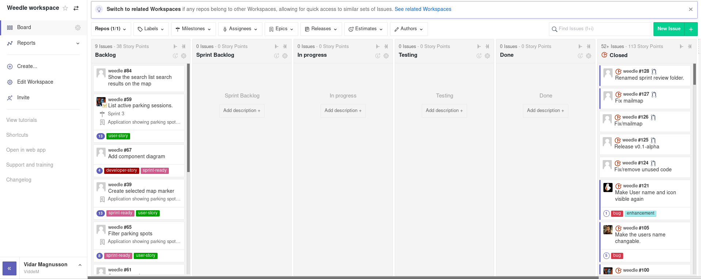

# README

## 1. Hur man kör programmet
Text

## 2. Tester (hur? vad? stats?)
Text

## 3. Scrumboard
Som scrum board i kursen använde vi oss av en webläsarplugin som heter [Zenhub](https://www.zenhub.com/) vilken lägger till ytterliggare funktioner till github. Den huvudsakliga featuren den lägger till är en extra "tab" på github, se bild nedan. 
Zenhub behöver alltså installeras av alla som vill se våran scrum-board, när man har gjort detta kan man se själva scrum-boarden. Vid tillfället denna readme skrivs ser den ut såhär (lite annorlunda från hur den sett ut tidigare i kursen på grund av att det inte är någon aktiv sprint just nu). 
Anledningen till att vi valde zenhub kan läsas i slutreflektionen. 

## 4. gitinspector
Resultatet från gitinspektor hittas i `documents/gitinspector.txt`, detta kommer från att köra gitinspektor med följande kommandon/flaggor `gitinspector -f ts,tsx,js,json -x package-lock.json,package.json --grading`. Här inkluderades de filtyper som vi har skrivit i själva samt exkluderas ett par autogenererade filer. Vi använde dessutom `--grading` flaggan vilken ger betydligt mer information på ett ganska trevligt formatterat sätt.

Det bör påpekas att vi gjorde en hel del par-programmering under kursens gång vilket lett till vis skev-het i hur personers arbetsmängd sett ut. Detta beskrivs mer detaljerat i slutrapporten.

## 5. Documents
Text

## 6. GitHub Wiki
Text

## 7. Prototyp
Text

## 8. Who's who
Text

## 9. Deadlines
Text
